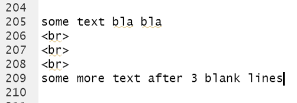

# RMarkdown - Syntax {#rmarkdownsyntax}
```{r setuples, include=FALSE}
les <- 5
knitr::opts_chunk$set(echo = TRUE, class.source="Rchunk", class.output="Rout")
library(ggplot2)
```

## Lesson Contents

 - Introduction 
 - Extended Markdown syntax (figures, tables, links, html tags, LaTeX formulas)
 - Chunk options vs global settings (e.g. ggplot theme)
 - Citations and footnotes
 
 <!-- - Output formats (slides, Word, Powerpoint, pdf, themes) -->
 <!-- - Publication grade reports (templates) -->


## Learning Outcomes

- You build on your RMarkdown skills from DAUR1 and are able to:
  - Produce publication-worthy figures and tables
  - Use html, links, latex in your Rmd
  - Set chunk options
  - Generate different output formats
- You have an overview of the current possibilities with Rmarkdown

## Introduction

By now you are in your 3rd course using R, and you will have learned that R is an incredibly useful tool for data analysis and visualisation. You have used ggplot to clean your data, make graphs, find desciptive statistics and are able to do the most common statistical tests in R. In DAUR1, you learned how to generate a html-file using Rmarkdown. But those were just the basics.

When working in a lab or other bioinformatics / life science positions, an important part of the work will be communicating about your findings en progress. You will have to write reports, give presentations, maybe write manuals or give weekly updates.

Using Rmarkdown gives you the opportunity to 
  A) automate part of these workflows (no copy-pasting graphs from excel to word, or typing p-values by hand)
  B) easily change your reports when needed (your supervisor read your report and wants some change in outlier selection, which will result in different averages, different graphs, different p-values? Sure, just update a few lines of code and knit your report again!)
  C) and do all this in an reproducible, open science way (you keep a direct connection between the data, analysis and communication, so everyone -including you in a few months time when you have forgotten- can easily see what you did)

Additionally, Rmarkdown is just plain text. A big advantage of plain text, is that it is really easy to work with. Github can use it for instance, and plain text is really easy to write compared to for instance html.

### Jupyter Notebooks
If you are starting to get to know the data science realm, you may have encountered people using Jupyter notebooks or Jupyter lab. These are web aplications that, like Rmarkdown combine data, analyses and text. They work with R as well, so that is neat for us! However, they are slightly more difficult to use. While Rmarkdown is in the end plain text, Jupyther notebooks are JSON documents. This is a useful format, but harder to combine with a workflow using git/github.

### Python
While we're on the subject, why aren't we teaching you Python? Not because we think there is some epic battle and you will either join the Python or the R side. We are not team R. In fact, most DSFB-teachers can write both. However, Python was developed by software engineers while R was developed by statisticians. So the workflows in using these tools for data science differ. You have some background in statistics but -usually- none in software development, so R will for most of you feel more natural. R is also specifically tailored for data science. As a consequence, R is used [more often](https://www.datacamp.com/community/tutorials/r-or-python-for-data-analysis) in the life science work field, academia in general, and for instance pharmaceuticals. Also, Bioconductor is used a lot when analysing high-throughput genomic data, thereby making R the dominant language in bioinformatics.

The top 3 most asked programming languages in job ads (vacatures) in English speaking countries are [Python, R and SQL](https://towardsdatascience.com/team-r-or-team-python-2f8cf04310e6). We will cover SQL in this course (SQL is a database language designed for using data in relational databases). You have learned some R. If you need to switch from R to Python in the future, this is easily done if you have enough experience in R. The languages are in fact rather similar. If you are comfortable using basic building blocks such as functions, for/while/if-loops and vectors/dataframes/lists/etc, learning to do this in a different language is quite easy. While the words differ a bit these building blocks still work in the same way.

### Workflow

Now that we had a look at the alternatives, let's go back to RMarkdown.
You may have used a workflow like this in the capstone assignments in DAUR1 and 2:

- labpartner 1 runs analyses and updates RMarkdown file
- labpartner 2 tries to do some work furtheron in the analysis 
- labpartner 1 emails .Rmd to labpartner 2
- 1 sends whatsapp message to 2 that they finished their part and that 2 may continue.
- 2 copy pastes their scripting work into the .Rmd
- and runs analyses and updates RMarkdown file
- 2 emails 1 again
- and whatsapps that they found additional issues.
- 1 and 2 go through issues in an online meeting with 2 typing
- 2 emails the updated .Rmd to 1
- etc

In the previous lessons, you learned how to collaborate in github. So you can use it to both work on the same Rmarkdown file.
The loop becomes:

- Edit RMarkdown file
- Commit changes to Git-repository and push
- merge your branch with main
- report issues in github
- perhaps have a drink while doing a teams meeting, we do not want to discourage meeting each other

### Continuous integration

This method fits in a 'continuous integration' workflow. You can continue working on the same project with multiple people, and frequently integrate your work to see if there are any errors or you are accidentally working on the same part of the project as a coworker.

For example, when making this reader, your teachers work within their own branches. Usually, we make a branch per task we take on for the day. We make sure we branch of from the main, and at least once a day we merge our work back into the main branch (Continuous integration). Usually this is at the end of the day. Two people may have worked on the same .Rmd file, but this is fine. Git merges them for us. We then make sure the main branch still knits to the html in this reader without crashing or otherwise messing up (Continuous testing). If we think the rest of the team would like to see an update, we publish the newest version of the reader to RSconnect, which publishes this reader as a website (Continuous deployment). You will have noticed that we update this reader frequently to change any issues you or we have found.


<!-- ### To get an example of paramterized RMarkdown: -->
<!-- Clone this repo and run the examples in the folder ~/work_flows/Rmd/ -->
<!-- https://github.com/uashogeschoolutrecht/work_flows -->

<!-- To see an interactive Graph run the example: -->

### Some basic advice and good practice

In this lesson we will focus a bit more on RMarkdown, as it offers a reproducible pathway from data to analysis to communication. Keep the following things in mind when starting an RMarkdown file:

  - first of all, think if you really want to use a Rmarkdown file for something. Are you running a quick analysis on something just for yourself? A script (File → New File → R Script) is faster. Do you plan om communicating about what you are doing in print/websites/a blog/a presentation/etc? Or do you want to work reproducible? Then you will want Rmarkdown. 
  - do not forget lesson 2 on data management and all lessons on github
  - You can run chunks (green triangle) or all the chunks up to that chunk (left of the green triangle). You don't need to knit the whole thing every time.
  - Do not put all your R code into one big chunk. Split your code and provide text inbetween, explaining methods or results. If you find you are building a .Rmd file with just one big chunk of code, you actually want a script. 
  - Do everything within your .Rmd file. Don't export data, change some numbers in Excel and load them back in. This is breaking the reproducible workflow. If you find a mistake in the raw data, fix it within the .Rmd and provide a comment explaining what you are doing.
  - That said, if you are working with very large datasets and loads of data wrangling steps, your .Rmd may get clunky and slow. You may consider using a script to do all the preparations on the data, save the data to a file, and load that file in your .Rmd. Do make sure that all these files are in the same project and the workflow is very clear!
  - `knitr::purl("name_of_your_file.Rmd", documentation = 2)` to turn your .Rmd into a script.
  - `knitr::spin("name_of_your_file.R", knit = FALSE, format = "Rmd")` to turn a script into an .Rmd. (Try these commands now)
  - Do spend enough time on formatting the final result. You want something that looks nice and feels professional. Not some messy html full of unlabeled code chunks and text starting next to a figure somewhere in the middle of the page.


<!-- _____________________ -->

## Figures and tables

Roughly, your average deliverable will consist of text, figures and tables. Text is pretty easy in RMarkdown. Just type. We believe in you.

### pictures

But your portfolio and projecticum-products will also contain pictures. 
There are basically three ways to include an image from an existing file:

 1. In an RMarkdown code chunk
 1. As a direct link to an image file with the `` tag
 1. From embedded html code

#### In an R-chunk call {-}
You can use the function from `{knitr}` `include_graphics()`
And give the chunk some settings for the width of the figure and the caption:

````
```{r examplefig,  out.width = "300px", fig.cap="'Optimus Prime'; Leader of the Autobots"}`r ''`
knitr::include_graphics(
  here::here(
    "images",
    "prime.jpeg"
  )
)
```
````


```{r examplefig,  echo=FALSE, out.width = "300px", fig.cap="'Optimus Prime'; Leader of the Autobots"}
knitr::include_graphics(
  here::here(
    "images",
    "prime.jpeg"
  )
)
```

The advantage of this approach is that you can use all the chunk options for this code chunk, controlling e.g. the size and behavior of the image as you would normally do for a code-generated graphs. Setting the `dpi` option in the code chunk controls the size of the image displayed in the rendered output. To see more options run `?knitr::include_graphics()` in the R console. 

If you would like to use the above chunk option -- We usually personally prefer this option because it is an R only solution -- you should know about the `{captioner}` package. This package helps you with numbering tables and figures and with it you can create standardized captions, or add captions to your figures from another source file. A good workflow would be to write all captions in a separate text file and add them to your R Markdown document using the `{captioner}`package. In this way you can more easily edit and revise captions separate from the main text. For more info on [`{captioner}`](https://cran.r-project.org/web/packages/captioner/vignettes/using_captioner.html)   

#### Markdown syntax {-} 
We can also use Markdown syntax like this.
See [this blog](https://medium.com/markdown-monster-blog/getting-images-into-markdown-documents-and-weblog-posts-with-markdown-monster-9ec6f353d8ec) for more details

```
{ width=20%}
```
Note that the path name is not a string

{ width=20%}

Setting `{ width=x%}` is a special control for Pandoc, which is the engine that converts RMarkdown to plain Markdown. This does not work for all Markdown dialects.

The advantage of this approach is that it is written very fast. You can also include an image from a web url like this

```

```


#### HTML {-} 

You can also include a local (or web url linked) image using html.

```
<div style="display: table;">
  <span>
  
  </span>
  <span style=" vertical-align: middle; 
                display: table-cell; 
                padding: 20px;">
  The advantage of this latter option is obviously that you can tweak the appearance and the behavior of your image far better using embedded html. The disadvantage might be that you would have to learn html. This however is a very good idea if you intend to become a Data Scientist/Bioinformatician.
  </span>
</div>
```

<!-- 
<!--      alt="Markdown Monster icon" -->
<!--      style="float: left; margin-right: 10px;" /> -->


<!--html_preserve-->
<div style="display: table;">
  <span>
  </span>
  <span style=" vertical-align: middle; 
                display: table-cell; 
                padding: 20px;">
  The advantage of this latter option is obviously that you can tweak the appearance and the behavior of your image far better using embedded html. The disadvantage might be that you would have to learn html. This however is a very good idea if you intend to become a Data Scientist/Bioinformatician.
  </span>
</div>
<!--/html_preserve-->

(Yes, you should use CSS if you are getting this deep into setting html div styles. We'll cover that later.)


### graphs

Adding basic graphs to an RMarkdown is something you already learned in DSFB1.

To display your graphs, you again give the chunck in which you generate it some settings. Let's use a really visually pleasing graph for the occasion ([source](https://adrienne-marshall.github.io/ggplot2_workshop/)), using 3 additional packages! 

````
```{r figdiam, echo=FALSE, fig.height = 5, fig.width = 5, fig.align = "center", fig.cap = "Cut and price of diamonds"}`r ''`
`#install.packages("ggridges")`
`#install.packages("viridis")`
`#install.packages("ggthemes")`
library(viridis)
library(ggplot2)
library(ggridges)
library(ggthemes)
ggplot(data = diamonds, 
       aes(x = price, y = cut, color = cut, fill = cut)) +
  geom_density_ridges(alpha = 0.8, scale = 5) +
  scale_fill_viridis(option = "A", discrete = TRUE) +
  scale_color_viridis(option = "A", discrete = TRUE) + 
  theme_few()
```
````

```{r figdiam, message=FALSE, error=FALSE, fig.cap = "Cut and price of diamonds", echo=FALSE, fig.height = 5, fig.width = 7, fig.align = "center", }
#install.packages("ggridges")
#install.packages("viridis")
#install.packages("ggthemes")
library(viridis)
library(ggplot2)
library(ggridges)
library(ggthemes)
ggplot(data = diamonds, 
       aes(x = price, y = cut, color = cut, fill = cut)) +
  geom_density_ridges(alpha = 0.8, scale = 5) +
  scale_fill_viridis(option = "A", discrete = TRUE) +
  scale_color_viridis(option = "A", discrete = TRUE) + 
  theme_few()
```

(Note that previous figures without captions were not included in the numbering)

### colour schemes: colour blind options

The default colours in ggplot are not equally visible for everyone. You may want to use colour blind friendlier palletes for your Rmarkdown documents, because you almost always are  making them for a larger public than just yourself. (Also, you might be colourblind yourself.) We can set colours manually:

```{r cbpgraph1,message=FALSE, error=FALSE, warning=FALSE, fig.cap="Colourblind penguin masses by species. Are penguins colourblind? It's all snow anyway.."}
cbp1 <- c("#999999", "#E69F00", "#56B4E9", "#009E73",
          "#F0E442", "#0072B2", "#D55E00", "#CC79A7")

library(palmerpenguins)

mass_hist <- ggplot(data = penguins, aes(x = body_mass_g)) +
  geom_histogram(aes(fill = species),
                 alpha = 0.8,
                 position = "identity") +
  scale_fill_manual(values = c("darkorange","purple","cyan4")) +
  theme_minimal() +
  labs(x = "Body mass (g)",
       y = "Frequency",
       title = "Penguin body mass")

mass_hist + scale_fill_manual(values = cbp1)
```

But the Rcolorbrewer package has some options too:

```{r, fig.height=7, fig.width=5}
library(RColorBrewer)
display.brewer.all(colorblindFriendly = TRUE)
```

```{r}
# Box plot
bp <- ggplot(iris, aes(Species, Sepal.Length)) + 
  geom_boxplot(aes(fill = Species)) +
  theme_minimal() +
  theme(legend.position = "top")

bp + scale_fill_brewer(palette = "Dark2")
```


```{r}
sp <- ggplot(iris, aes(Sepal.Length, Sepal.Width)) + 
  geom_point(aes(color = Species)) +
  theme_minimal()+
  theme(legend.position = "top")

# Scatter plot
sp + scale_color_brewer(palette = "Paired")
```

And you could check out the “viridis” and “magma” scales in the `viridis` package [here](https://cran.r-project.org/web/packages/viridis/vignettes/intro-to-viridis.html#the-color-scales).

If you are seriously interested in making figures for colourblind people, check [this website](https://jfly.uni-koeln.de/color/), especially figure 16.


<div class="question">
##### Exercise `r les` {-} 
Generate a graph with ggplot (any graph you like, here are some [examples](https://www.r-graph-gallery.com/267-reorder-a-variable-in-ggplot2.html)) and try some options to make it colourblind-friendly.
Test your figure [here](https://www.color-blindness.com/coblis-color-blindness-simulator/) (Export your graph to jpeg using the export option in Rstudio (bottom right, above the graph) or `ggsave()` and upload the file to this website.)
</div>

<!-- ### animations: gganimate? -->

<!-- XXX animations be here given time XX -->


### Tables

#### From tibble to table {-} 
In DAUR1 you learned how to knit tibbles into tables:


```{r}
data("mpg")
knitr::kable(head(mpg))
```

But you can make them interactive if you like:
```{r}
data("mpg")
library(DT)
DT::datatable(mpg)
```

#### Formatting tables {-} 
Of course we can generate and format more complex tables as well. The easiest way is to use the `kableExtra` package (Though check the `expss` package if some journal or person is insisting you should make APA-style tables). 

```{r}
#install.packages("kableExtra")
library(kableExtra)
# take just a few columns and rows for demonstration purposes
data_for_table <- mtcars[1:5, 1:6]

```

If you do not define anything, kable_styling() will render you the same table as the default knitr::kable
```{r}
data_for_table %>%
  kbl() %>%
  kable_styling()
```

Within kable_styling() you can change the settings, such as colours depending on the values displayed, or footnotes and extra headers:

```{r}
kbl(data_for_table) %>%
  kable_styling(bootstrap_options = "striped", 
                full_width = F, 
                position = "left")

data_for_table %>%
  kbl() %>%
  kable_classic_2(full_width = F) %>%
  row_spec(0, angle = -45) %>%
  column_spec(2, color = spec_color(mtcars$mpg[1:5]),
              link = "https://www.wikipedia.com") %>%
  column_spec(5, color = "white",
              background = spec_color(mtcars$hp[1:5], end = 0.7),
              popover = paste("am:", mtcars$am[1:5]))

kbl(data_for_table) %>%
  kable_classic() %>%
  add_header_above(c(" " = 1, "Group 1" = 2, "Group 2" = 2, "Group 3" = 2))%>%
  footnote(general = "Here is a general footnote for the table.")

```

If you want something specific, check out the vignette for the `kableExtra` package [here](https://cran.r-project.org/web/packages/kableExtra/vignettes/awesome_table_in_html.html)


#### Rmarkdown tables {-} 
You can also write tables within RMarkdown:

```
| Syntax      | Description |
| ----------- | ----------- |
| Header      | Title       |
| Paragraph   | Text        |
```

renders:

| Syntax      | Description |
| ----------- | ----------- |
| Header      | Title       |
| Paragraph   | Text        |

Which is a lot of work, so you would usually use [this table generator](https://www.tablesgenerator.com/markdown_tables)


<div class="question">
##### Exercise `r les` {-} 

Render a html-document with:

Your 5 favorite Pokemon characters as images (or choose any theme you prefer as long as you include at least 5 images: Marvel, Firefly, Zelda, Jane Austen novels, your favorite Netflix shows, perhaps 13 images for 13 reasons why, whatever you like). Make sure all the images end up the same size in your html and are distributed nicely.

Provide a table (note: a table is not the same as a tibble!) with some characteristics for these characters. Each pokemon should get a row in the table, with a different text colour.

Provide a graph depicting your rating of them on a 1-10 scale.
</div>


<!-- _____________________ -->

## Formatting

### LaTeX
You can write formulas in RMarkdown using LaTeX
The formula for a straigth line with slope `a` and intercept `b`

`$Y = aX + b$`

will give you:

$Y = aX + b$

You can use more latex syntax, but not all of it will work when rendering html files. For instance:

```
\begin{equation}
\label{eq-abc}
 \binom{n}{k} = \frac{n!}{k!(n-k)!}
\end{equation}
```
Renders the equation, but not the label:

\begin{equation}
\label{eq-abc}
 \binom{n}{k} = \frac{n!}{k!(n-k)!}
\end{equation}

When rendering PDF, you can also use it to change appearance like font size:

```
\footnotesize
tiny text! not tiny in html.
\normalsize
```
For HTML, you will want to use CSS formatting, we will discuss this later in this lesson.
To build more complex formula's you can use an online LaTeX equation builder, for instance [this one](https://www.latex4technics.com/). 

### HTML

You will really want to start focusing on using RMarkdown for professional deliverables. To do so, sometimes you want to edit the default way RMarkdown renders your output.

We already showed you can include images with html coding. You could use html syntax for everything in your RMarkdown, but then why are you using RMarkdown in the first place. However, there are a few html things that may come in handy. Do remember that these mainly work when rendering HTML files, and will break if you render pdf's. This may or may not be a major disadvantage depending on the project.

To get a line break in RMarkdown, you can finish a line with 2 spaces, and then hit return. If you want more than one blank line, you can use html commands:

{ width=40%}

Will yield:

> some text bla bla
> <br>
> <br>
> <br>
> some more text after 3 blank lines

If you want to highlight something (for instance because you don't want to forget adding something later), you can include tags, eg:

```
<mark> XXX more html here </mark>
```

`<div>` tags work too, these define a division or a section in an HTML document. We will use them later.

Use three or more `-` for a horizontal rule. For example,

```
text #mind the following blank line

---
```

yields:

---

### Links

You can include links like this:

```
[click here for the link](https://en.wikipedia.org/wiki/Open_science)
```

### More chunck settings

You learned some chunck settings in DAUR1:

Table with different chunk output options. **yes** means present in the output file. 

Option |	Run code |	Show code |	Output |	Plots |	Message |	Warning
:----|:-----|:---|:---|:---|:---|:---
eval = FALSE |	no |	**yes** |	no |	no |	no |	no
include = FALSE |	**yes** |	no |	no |	no 	| no |	no
echo = FALSE | 	**yes** |	no |	**yes** |	**yes** |	**yes** |	**yes**
results = "hide" |	**yes** |	**yes** |	no |	**yes** |	**yes** |	**yes**
fig.show = "hide" |	**yes** |	**yes** |	**yes** |	no |	**yes** |	**yes**
message = FALSE |	**yes** |	**yes** |	**yes** |	**yes** |	no 	| **yes**
warning = FALSE |	**yes** |	**yes** |	**yes** |	**yes** |	**yes** |	no


For instance, when writing a report, it's common to not want the R code to actually show up in the final document.
Use the `echo` chunk option to do this:
<!-- verbatim-code-chunks -->

````
```{r, echo=FALSE}`r ''`
1 + 1
```
````

or if you want the code to run but not show anything, use `include`

````
```{r, include=FALSE}`r ''`
1 + 1
```
````

Sometimes you may just want to show some R code with nice syntax highlighting but not evaluate it:

````
```{r, eval=FALSE}`r ''`
1 + 1
```
````

<div class="rstudio-tip">
Hints:

press `Ctrl + Alt + i` to insert a code chunk.

select some text and press `Ctrl + Shift + C` to make part of your text a comment, which will not be included in the rendered output.
</div>

Don't forget you can use chunk names, to be able to easily find them:

{width=40%}

You have used these options before. But there are more options you can give to chunks:

#### Cache {-}

If you know a chunk will not need to change as other parts of the document are knitted, you can cache a chunk that contains a potentially long-running or slow command or commands. Be aware that this means this chunk will not update if you change something to your data wrangling part.

````
```{r, cache=TRUE, echo=FALSE}`r ''`
library(ggplot2)
ggplot(mpg, aes(displ, hwy, color = class)) + 
  geom_point() # Some really slow plot
```
````


```{r slowplot, fig.cap = "Slow plot is slow", cache=TRUE, echo=FALSE}
library(ggplot2)
ggplot(mpg, aes(displ, hwy, color = class)) + 
  geom_point() # Some really slow plot
```

#### Chunk sizing {-} 

Customize output sizing with chunk options: `fig.width`, `fig.height`, `dpi`, `out.width`

for example:

````
```{r examplecars, fig.cap ="We made this graph smaller", fig.width = 4, fig.height = 4, echo=FALSE}`r ''`
ggplot(mpg, aes(displ, hwy, color = class)) + 
  geom_point() 
```
````

```{r examplecars, fig.cap ="We made this graph smaller", fig.width = 4, fig.height = 4, echo=FALSE}
ggplot(mpg, aes(displ, hwy, color = class)) + 
  geom_point() 
```

### css styles 

If you are familiar with writing html, you will know that most styling is done with CSS. Cascading Style Sheets (CSS) is a simple mechanism for adding style (e.g., fonts, colors, spacing) to Web documents.

By default, the HTML output of R Markdown includes the some predefined CSS classes for backgrounds: "bg-primary", "bg-success", "bg-info", "bg-warning", and "bg-danger".

Here we use bg-danger for the code, and bg-warning for the output. Try them out to see what they look like

````
```{r class.source="bg-danger", class.output="bg-warning"}`r ''`
mtcars[1:5, "mpg"]
```
````

But you can make your own styles as well:

````
```{css, echo=FALSE}`r ''`
.watch-out {
  background-color: lightpink;
  border: 3px solid red;
  font-weight: bold;
}
```
````

Then we assign a class `watch-out` to the code chunk via the
chunk option `class.source`.


````
```{r class.source="watch-out"}`r ''`
mtcars[1:5, "mpg"]
```
````


But defining all your styling stuff within your .Rmd gets messy quite quickly. So you can put them in a separate .css file. Put this file in the same folder as your .Rmd file.
To link one or multiple custom stylesheets to an Rmd document, you use the css option in your YAML header:

```
output:
  html_document:
    css: "my-style-sheet.css"
```

Within your .css file, you then define all the styling you want. 

For instance, define a class for text with borders:

In the .css file
```
.bordershere {
border-style: solid;
border-width: 5px;
border-color: purple;
}
```

You are not restricted to code chuncks when using css. You can use html `<div>` tags to apply a css style to part of your .Rmd, which may contain anything: text, images, code, etc:

In the .Rmd file
```
<div class="bordershere">
text
</div>
```

Here is an example to get you started with an css file: [click](https://gist.github.com/eirikbakke/1059266/d81dba46c76169c2b253de0baed790677883c221)

And if you really like formatting, check w3schools for loads of syntax:[click](https://www.w3schools.com/css/)

Note: if you use your own .css file, the predefined CSS classes (bg-danger etc) won't work anymore. But they are not the prettiest anyway.

<div class="question">

##### Exercise `r les` {-}

Go back to your html file with the 5 favorite Pokemon (or other) images. 

Make a css file, and use it to change all the body text to a nice colour, and all the headers to a different colour.

Make a new class containing some styling rules, and apply it to a part of your file (so you will also have to make a `<div>` somewhere in your page. Perhaps a nice text box with [rainbow border](https://codepen.io/unnegative/pen/dVwYBq) containing a written statement of your love for these Pokemon)

Include a link to the wikipedia page of your topic. Make the link change to a green colour [when you hover over it](https://www.w3schools.com/css/css_link.asp). 

</div>

## Cross referencing {#crossreffy}

note: Rmarkdown seems to have a hickup regarding crossreferences. Please change your output format in the YAML header to:

`output: bookdown::html-document2`

If you label parts of your RMarkdown, you can refer to them later! For instance, if you give names to code chunks, you can refer to them:

See Figure `\@ref(fig:cars-plot)`

````
```{r cars-plot, fig.cap="The cars data.", echo=FALSE}`r ''`
par(mar = c(4, 4, .2, .1))
plot(cars)  # a scatterplot
```
````

See Figure \@ref(fig:cars-plot)

```{r cars-plot, fig.cap="The cars data.", echo=FALSE}
par(mar = c(4, 4, .2, .1))
plot(cars)  # a scatterplot
```

<br>
This also works with tables, e.g.:

And see Table `\@ref(tab:mtcars)`.


Section headers can also be cross references. For instance, clicking [here](#crossreffy) will take you back to the beginning of the paragraph on cross referencing. 

We did this by giving the paragraph header a label:

`## cross referencing {#crossreffy}`

and linking to the label like this:

`[here](#crossreffy)`

You can also use the section number to refer to it:

`See paragraph \@ref(crossreffy)`

See paragraph \@ref(crossreffy)

## Citations

### Simple footnotes

You can do footnotes by hand within RMarkdown[^smallnote]. Even multiline-footnotes.[^bignote] like this:

[^smallnote]: You found the footnotes!

[^bignote]: Here's one with multiple paragraphs and code.
    In case you want to include whole novels in your footnotes.
    Even code chunks work fine: `r seq(1:5)` and images too.

    Please do not include novels in your footnotes by the way.

```
You can do simple footnotes within RMarkdown[^smallnote]. Even multiline-footnotes.[^bignote]

[^smallnote]: footnote text

[^bignote]: Here's one with multiple paragraphs and code.
    text
    code too `r seq(1:5)`
    
    And images:
    
    
    more text.
```

### Using a reference manager


If you are not already using a reference manager, life when writing reports is going to get a lot easier. Reference managers are software packages that store and organise all the references you use, usually including the pdf's.

We will use Zotero in this course, as Zotero is completely open source. If you use Mendeley or Endnote, you still can. Just google for how to integrate the software package of your choice in a Rmarkdown/github workflow. We had a Mendeley workflow last year, we put it in the "resources" page in the reader (see left in the menu.) It might still work. We won't keep it updated.

(note: if you already use a reference manager, do check if it provides BibTeX output. We need a .bib or .json file later.)

As Zotero with their latest update included a pdf-viewer, we are quite happy to move to Zotero now.

#### Download and install Zotero {-}

Go to the [Zotero website](https://www.zotero.org/) to download Zotero. Install and configure using default settings. Make sure you install as administrator.

You will have to create a Zotero account. 

#### start a new collection for workflows and one for projecticum {-}

[See this information on collections](https://www.zotero.org/support/collections_and_tags#creating_collections) and make two new collections. One for workflows and one for projecticum.

You can drag and drop pdf files into your zotero collections.

If this is your first time using Zotero: you can simply drag and drop pdf files into collections. It will automatically start searching the web for the meta data. If your pdf is a published paper, there will be a lot of meta data available.

#### Install the browser connector {-}

The fastest way to get papers into Zotero, is with their browser extension, or as they call it: connector. Download it [here](https://www.zotero.org/download/#).

You can add papers by clicking the browser extension icon in the upper right of your browser and add the paper to a collection. Zotero will download meta data and the pdf if available.

<div class="question">
##### Exercise `r les` {-}
Import some random paper from Pubmed into Zotero (drag & drop the pdf or use the web connector). What metadata do you get? 

Import some pdf you rendered yourself from RMarkdown into Zotero. What metadata do you get? 

</div>

#### Install the “Better BibTex for Zotero” Add-on {-}

As Zotero is open source, anyone can upgrade their software with extensions. We will add the “Better BibTex for Zotero” Add-on from [this website](https://retorque.re/zotero-better-bibtex/installation/) :

 1. In **Zotero**, go to Tools > Add-ons
 1. Select ‘Extensions’
 1. Click on the gear in the top-right corner and choose ‘Install Add-on From File…’
 1. Choose .xpi that you’ve just downloaded, click ‘Install’
 1. Restart Zotero

You will get a menu pop up for the add on.

 - Use the BBT default citekey format
 - just use all the default settings.

#### Install the rbbt package {-}

`devtools::install_github("paleolimbot/rbbt")`

 - restart Rstudio
 - go to Addins
 - You can add citations now by clicking on "insert Zotero citation". Zotero needs to be running.This will pop up a zotero search where you can search for a reference.
 - If you like, [make a shortkey](https://support.rstudio.com/hc/en-us/articles/206382178-Customizing-Keyboard-Shortcuts-in-the-RStudio-IDE) for adding citations 

We will not use the new "visual markdown editor”, mainly because your teachers don't like it. Feel free to explore on your own risk. 

In that case, select the addon here:

 1. In **Rstudio** go to tools > global options > Rmarkdown (left) > citations (top)
 1. select "use better bibtex"

```{r, echo=FALSE, message=FALSE, fig.width=8 }
knitr::include_graphics(here::here(
    "images",
    "zotero1.png"
  )
)
```

<div class="question">
##### Exercise `r les` {-}
In your Rmd for this lesson, add a few random citations from Zotero. Put square brackets around the citation if you don't want it "inline" but between brackets (after a sentence).

Don't knit the file yet.

(note: dragging and dropping citations from zotero to your Rmarkdown file also works in a way, but puts them in a format only recognised if you knit to pdf. )
</div>


#### make a bibliography (automatic header option) {-}

We need a file with all the references Zotero is currently managing for you. The format for a list of references, is a .bib file. 

Put the following line in your YAML header:

bibliography: "%r rbbt::bbt_write_bib("bibliography.json", overwrite = TRUE)%"

but replace % with ` 

knit your Rmd file. There will be a new file `bibliography.bib` in your folder, a nicely formatted citation in your tekst, and a bibliograhpy at the bottom of your html.

####  make a bibliography (manual option) {-}

 - select your collection in Zotero
 - click file > export library
 - select either better bibtex or better json
 - move the .bib or .json file to your R project folder
 - put a line in the yaml header referring to the file 
 (bibliography: references.bib  )

so your header will look like something this:

```
title: "Untitled" 
output: html_document 
bibliography: bibliography.bib
```

#### update your .json/.bib file {-}

Add another reference with the add-on ...

and now update your .json file with:

```{r, eval=F}
library(rbbt)

bbt_update_bib("test_zotero.rmd")
```
 
#### formatting citations {-}

see [here](https://bookdown.org/yihui/rmarkdown-cookbook/bibliography.html) how to format your citations and info on how, for instance, to get appendices after a bibliography.

#### cite! {-}
 
You can now cite papers it in your .Rmd using the rbbt Addon and using citation keys:
  
  ```
  They said something really smart [@VanLissa2021].
  ```
or two people:

  ```
  Some people agree with her [@dehaan08; @vangestel18].
  ```

or include additional information:

  ```
  As do colleagues[see @teunis99, pp. 33-35; also @svanoef04, ch. 1].
  
  or inline:
  
  @smith04 [p. 33] says blah.
  
  ```

Use a minus sign if you don't want to include the names:

  ```
Van der Ploeg says so too [-@vdploeg04].
  ```

#### How to cite, when to cite...

We did a class exercise on this. If you feel you want to revisit the rules on citing, paraphrasing, summarising, etc, to avoid plagiarism, the KU Leuven has a very good summary [here](https://hiw.kuleuven.be/nl/studeren/papers/plagiaat/adequaatverwijzen)

Do you want to practice more? Try [this tutorial](https://owl.excelsior.edu/plagiarism/)

#### Start a Zotero group for your projecticum {-}

[see here](https://www.zotero.org/groups/)


## Portfolio assignment `r paste0(les, " ")` {-}  
<div class="dagopdracht">

**Portfolio assignment `r les`**

A)

 - Make sure you have:
    1. Two personal repositories on github: one for your portfolio, one for the regular exercises.
    1. One repo in the projecticum organisation, that you share  with your partner.
    1. Your local repositories are up to date with the main for all three of them.
    1. A github project, with kanban board filled with issues connected to the projecticum repository.
    1. One (separate!) .Rmd file for each of your projecticum assignments.
    1. Three local (i.e. on your laptop) Rstudio projects: projecticum, portfolio and regular_assignments. (you may have given them other names, that's fine)


B)

  1. Make a new collection within Zotero for the projecticum. Place all pdf's you used till now in your folder (if you did not use any papers as source yet, find 3 papers on Pubmed now that you could use for your introduction.). 
  1. Start a .Rmd named "introduction.Rmd" with a few lines introduction on your projecticum topic.
  1. Include automatic inline references to the papers you used.
  1. The bibliography will be placed at the end of the document. Provide an appropriate header.
  
NOTE! Now we will try collaborating using .bib or .json files. We are not entirely sure what will happen if you knit and merge bib/json files using the automatic header option. If you used that to quickly and conveniently get all the references in a .bib/.json file, you may want to change your header to something like this now, and update everytime you add a reference:

```
title: "Untitled" 
output: html_document 
bibliography: bibliography.bib
```

Or try if you can get it to work with the automatic option! We are curious to see what will happen.

Either way:

  1. Merge your work with that of your projecticum partner through github. Solve all the problems you encounter. If github does not want to merge .bib or .json files and you want a merged one, try [here](https://caltechlibrary.github.io/bibtex/webapp/bibmerge.html).
  1. Find out how you can add websites as reference to Zotero.
  1. In your portfolio, write at least 500 words of introduction for your projecticum project and use at least 5 references.


</div>


<!-- maybe later -->
<!-- ## Summary -->

<!-- - Markdown is a simple plain text format suitable for authoring rich documents -->
<!-- - RMarkdown is a slight extention of the Markdown syntax that lets us mix code and prose together -->
<!-- - RMarkdown is a key part of the R reproducible science scene -->
<!-- - RStudio is a great way to author RMarkdown documents -->
<!-- - Later on in this workshop, we'll see how to deal with citations so we can write academic manuscripts -->

<!-- ### <mark>**EXERCISE 1; Create a short report**</mark> {-} -->

<!--  1. Find a relevant dataset  that you recently found or are busy with at the moment* -->
<!--  1. Write a short Rmd report where you LOAD and VISUALIZE (create at least 3 different graphs) the data in an Rmd report. -->
<!--  1. Publish the exploratory analysis in your portfolio -->

<!-- *If you do nog have a dataset, you can use this one: -->
<!-- "./data/API_AG.LND.FRST.K2_DS2_en_csv_v2_716262" -->

<!-- **Place it on you github (portfolio) repo and send me the link.** -->


## Resources

https://nceas.github.io/sasap-training/materials/reproducible_research_in_r_fairbanks/index.html

https://guides.github.com/features/mastering-markdown/


